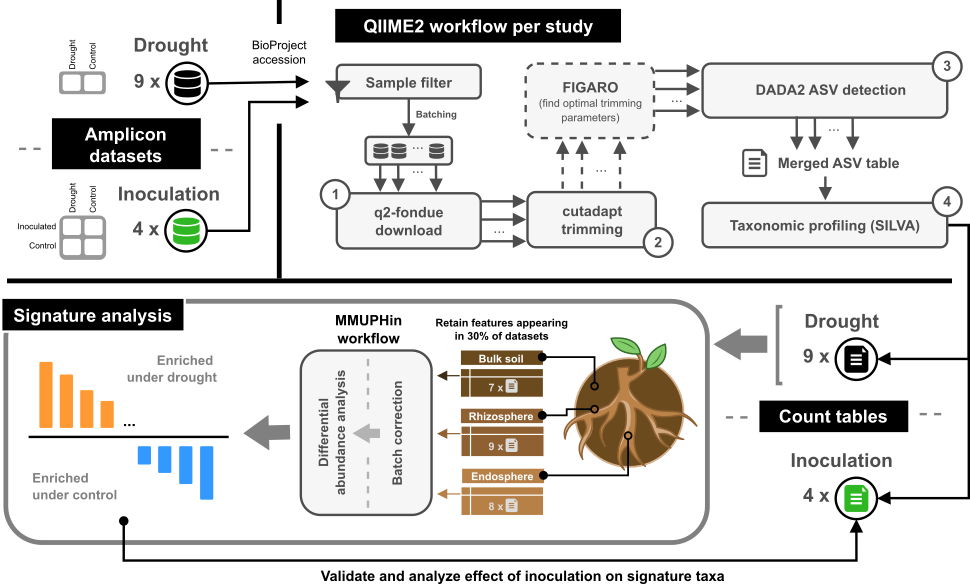

# A pipeline to process amplicon data for the root and soil microbiome

This repository is associated with the following manuscript:

Cosma B-M and Abeel T (2026) **A conserved bacterial signature characterizes plant microbiome responses to drought**. _Front. Microbiol._ 17:1768028. doi: [10.3389/fmicb.2026.1768028](https://www.frontiersin.org/journals/microbiology/articles/10.3389/fmicb.2026.1768028/full)

A schematic of the pipeline is shown below. We used QIIME2 to download and process amplicon sequencing data up to taxonomic profiles at genus level, and performed downstream analysis in Python (and R). Processed datasets used in our analysis are available in the ```datasets/``` folder.



## Installation

To install the required environments and packages, you can run:

```bash
conda env create -f general.yml && conda env create -f qiime2-amplicon-2024.10.yml
```

## QIIME2 pipeline example usage

We use QIIME2 with the q2-fondue plugin to process amplicon datasets from NCBI on a Slurm cluster. Inputs can be an accession or an existing study directory.
If a study directory with an existing `accession.tsv` file already exists:
```bash
cd bash_scripts
./pipeline.sh --study_id study_name
```

If a study directory does not exist, you can provide a study accession and a study name, which will create a study fodler with an accession file:
```bash
./pipeline.sh --study_id study_name --accession EXAMPLE123456,EXAMPLE234567
```

To run only selected steps of the pipeline:
```bash
./pipeline.sh --study_id study_name --accession EXAMPLE123456,EXAMPLE234567 --run_download --run_cutadapt
```

For the full list of pipeline steps, options and flags, run:
```bash
./pipeline.sh --help
```

## Signature analysis and figure reproduction

To reproduce the analysis and associated figures in the paper, you can run:
```bash
python3 plot_figure_[figure_number].py
```
